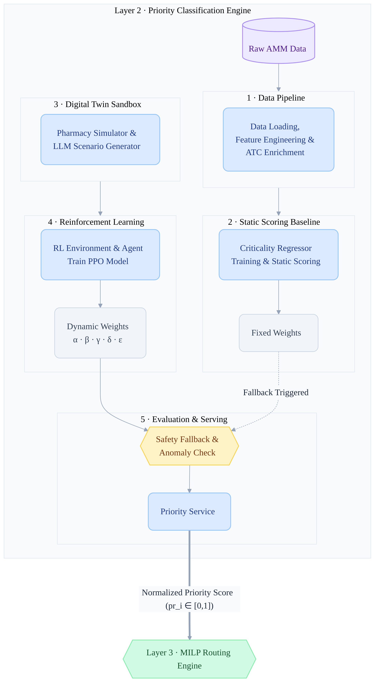
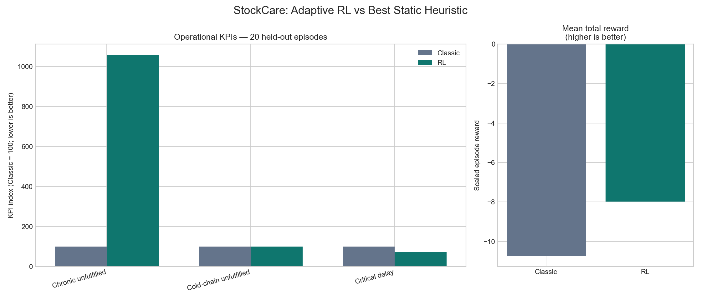
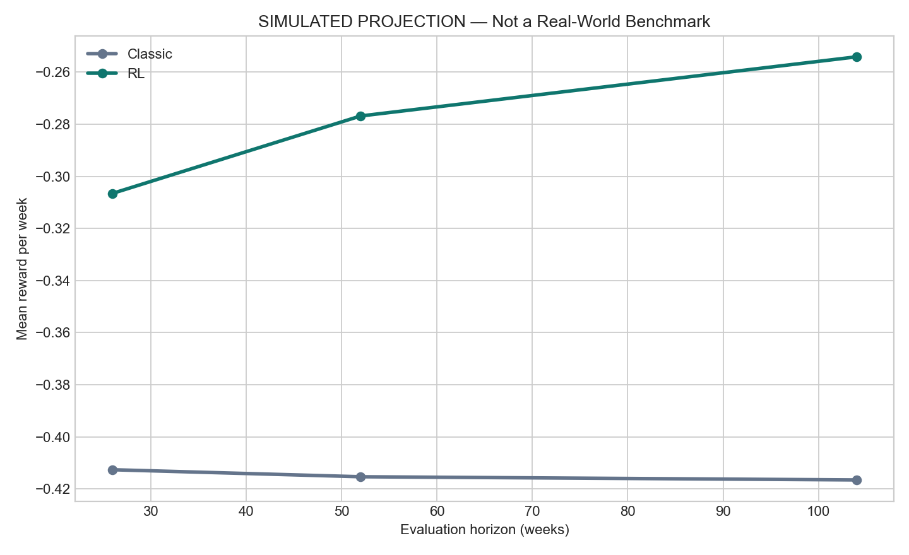

# StockCare Priority Engine

StockCare is **Layer 2** of a medicine-distribution decision system for Tunisia. It transforms the Tunisian DPM AMM medicine registry into normalized priority scores that a downstream routing engine can use when depot capacity is scarce.

The project combines:

- AMM registry cleaning and feature engineering;
- pharmacist-reviewed criticality annotations;
- a LightGBM criticality model for unannotated DCI values;
- a deliberately scarce pharmacy-depot simulator;
- a PPO reinforcement-learning agent that adapts priority weights;
- a safety-controlled FastAPI service for live scoring;
- evaluation against the strongest static heuristic used in this demo.

> This is a decision-support prototype, not a clinical prescribing system. Production use requires governance, monitoring, pharmacist validation, real demand data, and validation against operational outcomes.

## Architecture



The diagram describes the overall concept. The current implementation uses **six** dynamic factors rather than the five Greek-letter weights shown in the original illustration. ATC enrichment and LLM scenario generation are conceptual extensions; the implemented pipeline uses the fixed pharmacist annotation file and stochastic simulator described below.

## What the priority means

For pharmacy `i` and medicine/DCI `m`, the service calculates:

```text
priority(i,m) =
    w0 × criticality(m)
  + w1 × stockout_risk(i,m)
  + w2 × irreplaceability(m)
  + w3 × cold_chain_sensitive(m)
  + w4 × population_impact(i,m)
  + w5 × made_in_tunisia(m)
```

The result is clipped to `[0, 1]`. Higher values indicate higher allocation priority.

| Factor | Meaning | Source |
|---|---|---|
| `criticality` | Clinical importance score from 0 to 1 | Pharmacist ground truth or LightGBM prediction |
| `stockout_risk` | Live pharmacy/DCI shortage risk | Layer 1 or operations data |
| `irreplaceability` | Inverse of the number of same-DCI, same-dose substitutes | AMM catalogue |
| `cold_chain` | Cold-chain sensitivity indicator | DCI, form, and product-type rules |
| `population_impact` | Local demand/population importance | Layer 1 or operations data |
| `local_manufacturing` | Fraction of the DCI's AMM specialties made in Tunisia | AMM country field |

The PPO policy returns adaptive weights for these factors. Actions are bounded **deltas on weight logits**, so one action cannot replace the complete weight vector. Softmax converts the logits into non-negative weights that sum to one.

## Data

The raw input is `data/raw/Medicaments_Tunisie_AMM.xlsx`, containing 6,058 AMM specialties and 1,088 unique DCI values.

The fixed ground-truth file is `data/processed/criticality_annotations.csv`. It contains pharmacist-reviewed DCI annotations and must never be regenerated or replaced with invented labels.

Important generated datasets:

| File | Description |
|---|---|
| `amm_clean.parquet` | Cleaned 10-column AMM registry |
| `enriched_catalogue.parquet` | AMM rows plus substitution, cold-chain, and local-manufacturing features |
| `catalogue_scored.parquet` | Enriched rows plus DCI-level criticality and prediction flag |
| `medicaments_tunisie_priorities.csv` | Full audit export with factors and computed priorities |
| `pharmacy_delivery_priorities.csv` | Compact pharmacy-facing export with medicine identifiers and one final priority value |

The compact CSV uses zero for the unavailable live `stockout_risk` and `population_impact` inputs. Live, pharmacy-specific scoring should use the API instead.

## Pipeline stages

### 1. AMM loading

`src/data_pipeline/load_amm.py`:

- assigns the canonical ten-column schema;
- strips leading and trailing whitespace from strings;
- normalizes dirty medicine-type values;
- parses `date_amm` as datetime;
- removes fully empty rows;
- verifies 6,058 rows and 1,088 unique DCI values.

### 2. Feature engineering

`src/data_pipeline/feature_engineering.py` adds:

- normalized dosage keys;
- substitute counts and irreplaceability;
- cold-chain sensitivity;
- injectable products requiring manual cold-chain review;
- `made_in_tunisia` from the AMM country field;
- placeholders used by later stages.

### 3. Static criticality scoring

`src/static_scoring/train_criticality_regressor.py` aggregates the catalogue to one row per normalized DCI. It trains a small LightGBM regressor using the fixed pharmacist annotations, predicts scores for every unannotated DCI, preserves ground-truth scores exactly, and broadcasts DCI-level scores back to all AMM rows.

### 4. Digital twin

`src/digital_twin/pharmacy_simulator.py` models 20 pharmacies, 60 sampled medicines, stochastic demand, import disruption, epidemics, stockouts, and deliberately scarce depot capacity. Allocation is greedy by priority. Its reward penalizes:

- chronic unfulfilled demand;
- cold-chain unfulfilled demand, with the largest coefficient;
- critical delay;
- overstock.

This is a minimal learning sandbox, not a geography or routing simulator.

### 5. RL environment and PPO

`src/rl_env/priority_weighting_env.py` exposes:

- a 7-dimensional observation containing stockout rates, seasonality, and shock flags;
- a 6-dimensional bounded action containing weight-logit deltas;
- 26-week episodes;
- scaled simulator rewards.

`src/rl_agent/train_ppo.py` trains Stable-Baselines3 PPO for 30,000 timesteps and compares it with:

- equal weights: `[1/6] × 6`;
- criticality-heavy weights: `[0.55, 0.15, 0.10, 0.10, 0.05, 0.05]`.

Models are written to `models/rl_agent/`.

### 6. Evaluation

`src/evaluation/compare_rl_vs_classic.py` compares adaptive PPO with the criticality-heavy static heuristic over 20 held-out episodes using seed 999.

Current simulator results:

| KPI | Classic | RL | Improvement |
|---|---:|---:|---:|
| Chronic unfulfilled | 31.6691 | 335.8780 | -960.58% |
| Cold-chain unfulfilled | 6.3031 | 6.3031 | 0.00% |
| Critical delay | 21,374.0332 | 15,249.7571 | 28.65% |
| Total reward | -10.7281 | -7.9702 | 25.71% |

RL improves total reward and critical delay but currently worsens chronic unfulfilled volume. This tradeoff is reported transparently and indicates where reward design and validation need further work.



The long-term figure is a **simulator projection**, not a real-world benchmark:



## Priority API

`src/api/priority_service.py` loads the PPO model and DCI catalogue once at startup.

Endpoints:

| Method | Path | Purpose |
|---|---|---|
| `POST` | `/context` | Replace the current seven-field depot context |
| `GET` | `/weights` | Recompute the six adaptive weights for the latest context |
| `POST` | `/priority-scores` | Score a batch of pharmacy/DCI requests |

Unknown DCI values return `pri: null` and `note: "dci_not_found"` without failing the batch.

The service uses fixed fallback weights `[0.55, 0.15, 0.10, 0.10, 0.05, 0.05]` when prediction fails, contains NaN, or produces any weight above 0.85. Every affected response includes `fallback_used: true`.

If `LAYER3_WEBHOOK_URL` is configured, the background loop pushes fresh weights to Layer 3. `REFRESH_INTERVAL_SECONDS` controls the interval and defaults to 60 seconds. Connection failures are logged without stopping the service.

## Installation

Python 3.11 or newer is recommended.

```bash
python -m pip install -r requirements.txt
```

## Reproducing the project

Run commands from the `stockcare-priority-engine` directory:

```bash
python src/data_pipeline/load_amm.py
python src/data_pipeline/feature_engineering.py
python src/static_scoring/train_criticality_regressor.py
python src/digital_twin/pharmacy_simulator.py
python -m src.rl_env.priority_weighting_env
python -m src.rl_agent.train_ppo
python -m src.evaluation.compare_rl_vs_classic
```

Training deletes or replaces no annotation data. A full PPO run uses 30,000 timesteps and takes roughly two minutes on the development CPU.

## Running the service

```bash
uvicorn src.api.priority_service:app --host 127.0.0.1 --port 8000
```

Then open:

- API documentation: `http://127.0.0.1:8000/docs`
- OpenAPI schema: `http://127.0.0.1:8000/openapi.json`

Example context update:

```bash
curl -X POST http://127.0.0.1:8000/context \
  -H "Content-Type: application/json" \
  -d '{
    "stockout_rate_chronic": 0.20,
    "stockout_rate_essential": 0.10,
    "stockout_rate_comfort": 0.05,
    "season_sin": 0.50,
    "season_cos": 0.866,
    "import_disruption_active": 1.0,
    "epidemic_active": 0.0
  }'
```

Example priority request:

```bash
curl -X POST http://127.0.0.1:8000/priority-scores \
  -H "Content-Type: application/json" \
  -d '[{
    "pharmacy_id": "PHARMACY_001",
    "dci": "INSULINE HUMAINE",
    "stockout_risk": 0.80,
    "population_impact": 0.70
  }]'
```

## Project structure

```text
stockcare-priority-engine/
├── data/
│   ├── raw/
│   └── processed/
├── docs/
│   └── priority_engine_diagram_soft.png
├── models/
│   └── rl_agent/
├── src/
│   ├── api/priority_service.py
│   ├── data_pipeline/{load_amm.py, feature_engineering.py}
│   ├── digital_twin/pharmacy_simulator.py
│   ├── evaluation/compare_rl_vs_classic.py
│   ├── rl_agent/train_ppo.py
│   ├── rl_env/{state_builder.py, priority_weighting_env.py}
│   └── static_scoring/train_criticality_regressor.py
├── README.md
└── requirements.txt
```

## Safety and limitations

- The service never silently falls back; `fallback_used` is always visible.
- The PPO action changes logits incrementally and cannot directly replace all weights.
- Pharmacist annotations remain authoritative for covered DCI values.
- The simulator uses synthetic demand and shocks, not real pharmacy transactions.
- No geography, vehicle routing, lead-time network, or MILP routing is implemented here; those belong to Layer 3.
- Evaluation results are simulator evidence only and must not be represented as a real-world clinical or operational benchmark.
- Live pharmacy-level priority requires real `stockout_risk` and `population_impact` inputs.
